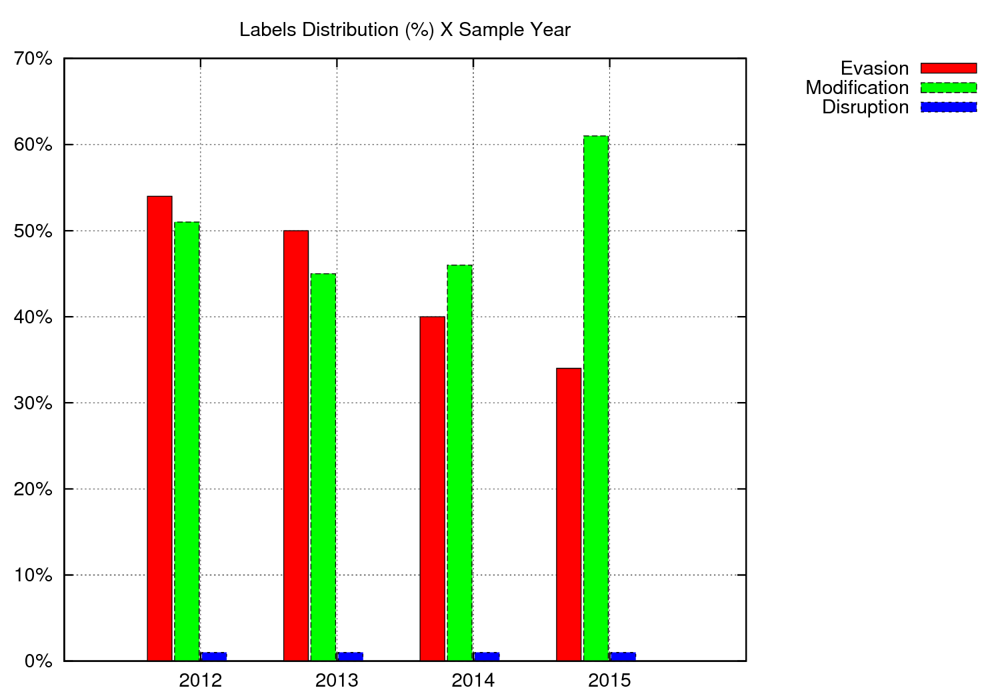
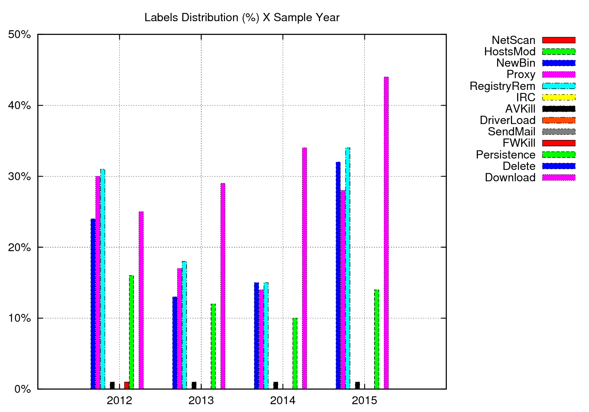
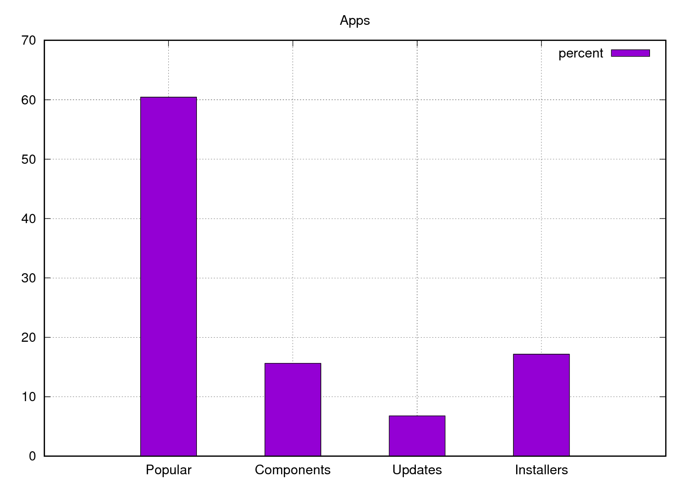
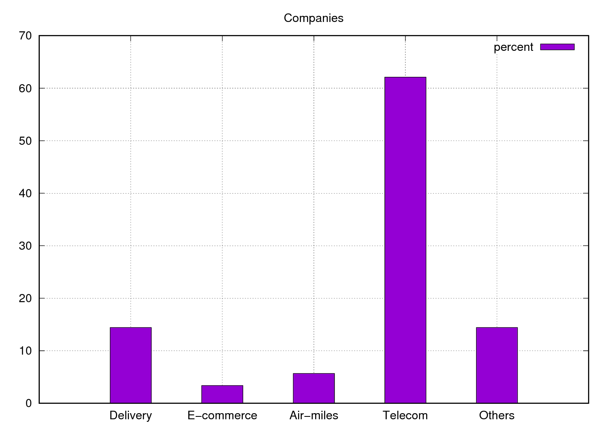
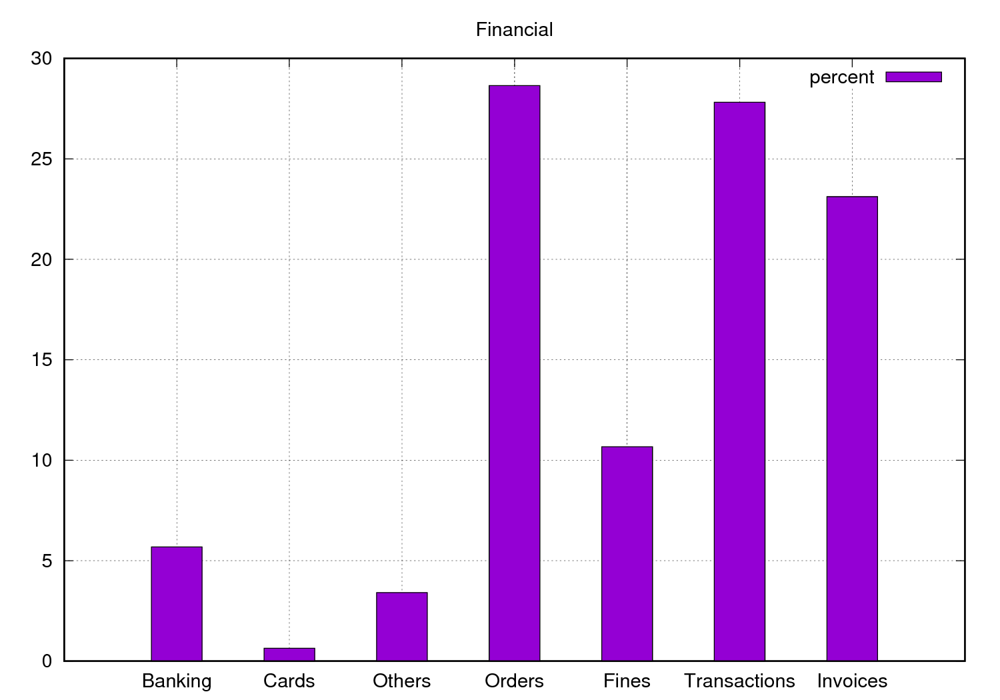
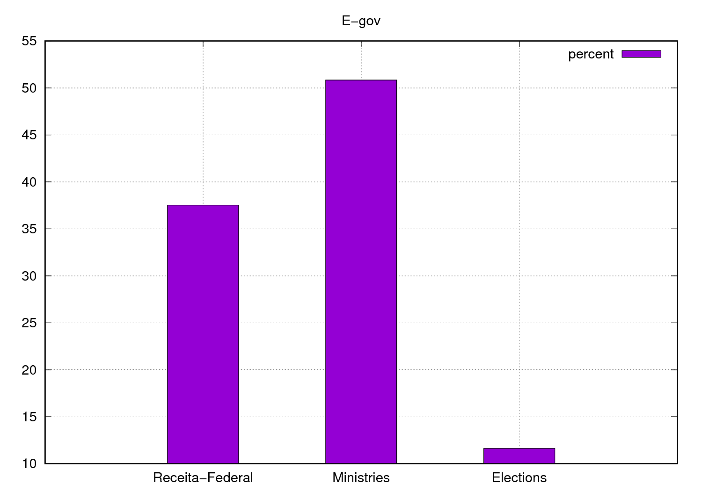
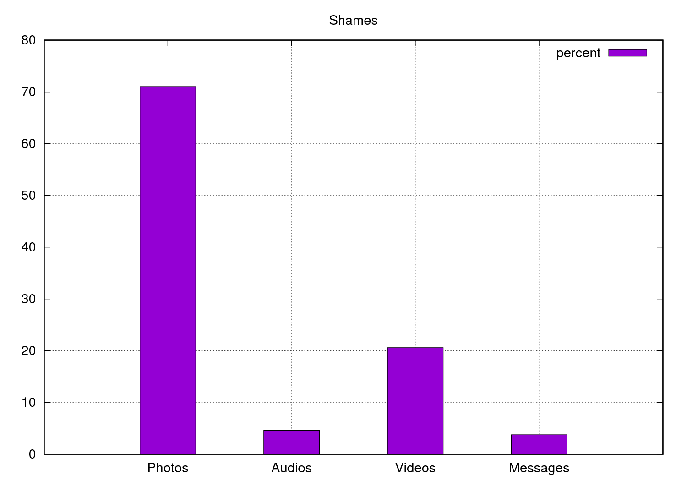
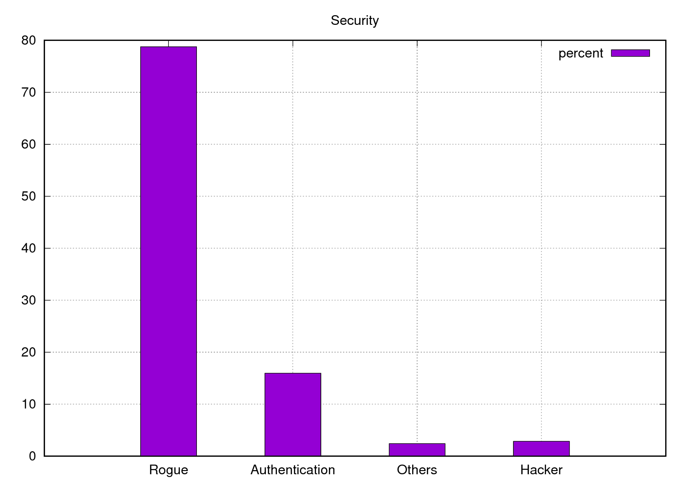

# One Thousand and One Nights: Brazilian Malware Stories

## What is ?

It's a research project we conducted from 2012 to 2017 analyzing more than 40K brazilian malware samples in order to characterize them.

## About us

This research was conducted by [Marcus Botacin](www.lasca.ic.unicamp.br/~marcus), started
while a Junior Researcher at the [Institute of
Computing](http://www.ic.unicamp.br/) from [University of
Campinas](http://www.unicamp.br/unicamp/), being advised by [Prof. Dr. Paulo
Lício de Geus](http://www.lasca.ic.unicamp.br/paulo/) and [Prof. Dr. André
Ricardo Abed Grégio](https://sites.google.com/site/argregio/).

## Publications

You can read our findings on the following publications:

### English
	TBA

### Portuguese

[Uma Visão Geral do Malware Ativo no Espaço Nacional da Internet entre 2012 e 2015](http://siaiap34.univali.br/sbseg2015/anais/WFC/artigoWFC02.pdf) (2012-2015)

## Presentations

* [GTS 26 PDF](https://github.com/marcusbotacin/Talks/blob/master/GTS26/02-analise-malware.pdf)
* [GTS 26 Youtube](https://www.youtube.com/watch?v=Iwy6nuEVNkc)

## Repository goal

I intend to provide here additional research data. It covers analysis results not included on the final version and/or developed tools/scripts.

## Analysis Tools

A list of tools which helped me during research development.

* [Pyew](https://code.google.com/p/pyew/)
* [Peframe](https://github.com/guelfoweb/peframe)
* [PEiD](https://www.aldeid.com/wiki/PEiD)
* [PEV](https://github.com/merces/pev)
* [Foremost](http://foremost.sourceforge.net/)
* [Wireshark](https://www.wireshark.org/)
* [Tcpdump](http://www.tcpdump.org/)
* [Tshark](https://www.wireshark.org/docs/wsug_html_chunked/AppToolstshark.html)
* [UPX](https://upx.github.io/)
* [nDPI](http://www.ntop.org/products/deep-packet-inspection/ndpi/)
* [GeoIP](https://pypi.python.org/pypi/GeoIP/)

The tools' usage was automated using [these
scripts](https://github.com/marcusbotacin/Malware.Analysis.Utils)

Dynamic malware analysis was performed using our developed sandbox solution
[BehEMOT](https://github.com/marcusbotacin/BehEMOT-NG).

## Analyzed Data

On the *Data* directory, you can find:

* **md5.txt**: MD5 of unique samples (2012-2015).
* **md5.2017.txt**: MD5 of unique samples (2012-2017).
* **hash.names.txt**: MD5-names of many samples.
* **ext.txt**: Sample's extensions.
* **ftypes.txt**: Sample's filetypes.
* **top_packers.txt**: All identified packers **without** filters.
* **top_packers_parsed.txt**: Counting identified packer **without** filters.
* **av_total.txt**: AV detection for each sample.
* **cpl.txt**: Samples which presented itself as *CPL*.
* **run_keys.txt**: Registry *\Run* key writes **without** filters.
* **dotnet.txt**: Samples which presented *.Net* characteristics.
* **peframe.db**: PEframe database.
* **js.txt**: MD5 hashes of collected JS files.
* **js.deobfuscated.txt**: MD5 hashes of deobfuscated JS files.
* **vbe.txt**: MD5 hashes of VBE (encoded) files.
* **vbs.txt**: MD5 hashes of VBS (decoded) files.
* **jar.txt**: MD5 hashes of JAR files.
* **jar.classes.txt**: MD5 hashes of Java classes (source) files.


### Using the database

The database has the following schema:

```
CREATE TABLE short (directory TEXT, pefversion NUMERIC, datetime TEXT, id INTEGER PRIMARY KEY, filename TEXT, filesize TEXT, timestamp TEXT, dll TEXT, sections NUMERIC, md5 TEXT, sha1 TEXT, imphash TEXT, packer TEXT, antidbg TEXT, antivm TEXT);
CREATE TABLE show_antidbg (id NUMERIC, name TEXT);
CREATE TABLE show_antivm (id NUMERIC, name TEXT);
CREATE TABLE show_apisuspicious (id NUMERIC, name TEXT);
CREATE TABLE show_meta (id NUMERIC, meta TEXT);
CREATE TABLE show_secsuspicious (sha1 TEXT, md5 TEXT, id NUMERIC, name TEXT);
CREATE TABLE show_packer (name TEXT, id NUMERIC);
CREATE TABLE show_file (id NUMERIC, file TEXT);
CREATE TABLE show_url (id NUMERIC, url TEXT);
```

So you can perform queries such as:

```
sqlite> select samples.md5,anti.name from short as samples,show_antivm as anti where samples.id==anti.id and anti.name LIKE '%QEmu%';
```

Getting the result:

```
c112e9bcd913f6e627beee6027864c6d|Bochs & QEmu CPUID Trick
01a2117f1bddf31fefd5274a196e6866|Bochs & QEmu CPUID Trick
0411910dc4d4db20011b0e07c1d19808|Bochs & QEmu CPUID Trick
2a31aefcb399cbba85aba0d938d13dd2|Bochs & QEmu CPUID Trick
2ef5caa75e0ea93e5a05ac2f6d73aeda|Bochs & QEmu CPUID Trick
36d1dd2c5180c5d4183e49aa8f2e2ad9|Bochs & QEmu CPUID Trick
8dd20b7e63fe62e8562658c054d3a8f3|Bochs & QEmu CPUID Trick
db4c42351b425289236f412285bc9aae|Bochs & QEmu CPUID Trick
dcf62559013dbbc04dbf2d8426c7181f|Bochs & QEmu CPUID Trick
e9610e3e8ec4043767601f5f16c6d4ec|Bochs & QEmu CPUID Trick
```

### Reproducibility Notice

We think reproducibility is very import, so we provide the data we used to
perfom analysis. However, you should take care of metrics when trying to
reproduce the presented experiments. When doing so, consider the applied
metric, such as wether the number of samples is the total or **uniques**,
total or **by filetype**, total or **by extension**, total or those which
**presented a given behavior**, and so on. You should also care about the 
date of the data you are looking into, since we conducted distinct studies
on distinct years. 

If you are looking for some data which is not available here, please 
get in contact, so I can update the repository.

## Tools

The *Tools* directory contains scripts I've written to help parsing and data analysis.

## Plot

On the *Plot* directory, you can find gnuplot data and scripts for reproducing some graphs from the paper. If you are interested on how we automated script generation, take a look [here](https://github.com/marcusbotacin/Writing.Tools.git).

## Additional Results

Analysis not included on the final paper:

### Taxonomy

[BehEMOT's Taxonomy](https://github.com/marcusbotacin/BehEMOT-NG/) results for the observed behaviors.

The following behavior classes results were found along the years:



The following behavior labels results were found along the years:



We didn't fully analyzed these data, so further analysis is required. The
growth of the *Modifier* class may be related to the growth of the
*Download* label. We don't have any keys about why the *Evasion* class
decreased. An experiment would be associate such behavior with the
increasing number of .Net and CPL files.

### Names

Besides the general classes presented on the paper, we also detailed sub-classes for each category, as presented below.



It reflects people's interests for popular applications.



Among companies, telecoms are the most target. It can be explained by the attacker's interest on pre-paid accounts.



On the financial subject, attackers try to get credit information by sending fake payment bills.



The largest entity involved is the *Receita Federal*, due to the online tax-payment software.



Among the subjects related to personal shames, the most frequent is the *photos* topic.



On the security area, most users are fooled by rogue security solutions.
